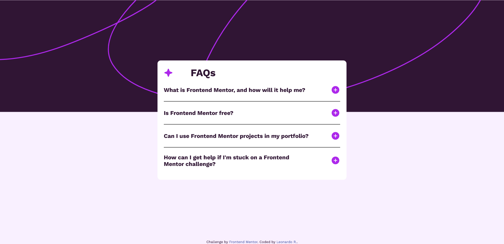

# Frontend Mentor - FAQ accordion solution

This is a solution to the [FAQ accordion challenge on Frontend Mentor](https://www.frontendmentor.io/challenges/faq-accordion-wyfFdeBwBz). Frontend Mentor challenges help you improve your coding skills by building realistic projects. 

## Table of contents

- [Overview](#overview)
  - [The challenge](#the-challenge)
  - [Screenshot](#screenshot)
  - [Links](#links)
- [My process](#my-process)
  - [Built with](#built-with)
  - [What I learned](#what-i-learned)
  - [Continued development](#continued-development)
- [Author](#author)

## Overview

A FAQ Accordion created with HTML, CSS and JavaScript

### The challenge

The challenge is to build out this FAQ accordion and get it looking as close to the design as possible.

You can use any tools you like to help you complete the challenge. So if you've got something you'd like to practice, feel free to give it a go.

Your users should be able to: 

- Hide/Show the answer to a question when the question is clicked
- Navigate the questions and hide/show answers using keyboard navigation alone
- View the optimal layout for the interface depending on their device's screen size
- See hover and focus states for all interactive elements on the page

### Screenshot

### Links

- Solution URL: [Add solution URL here](https://your-solution-url.com)
- Live Site URL: [Add live site URL here](https://your-live-site-url.com)

## My process

First, I tried to separate the html more semantically, before creating the style in css, thinking mobile first.
Finally, I used JavaScript to hide and show the information.

### Built with

- Semantic HTML5 markup
- CSS custom properties
- Mobile-first workflow

### What I learned

Not only did it reinforce my knowledge of HTML, CSS, and JavaScript, but I also found out about Tabindex for the keyboard.

### Continued development

I still don't know how to control the tabindex very well and I need to improve my semantics, as I feel like It could be more organized

## Author

- Website - [Leonardo R](https://github.com/leozende)
- Frontend Mentor - [@leozende](https://www.frontendmentor.io/profile/leozende)